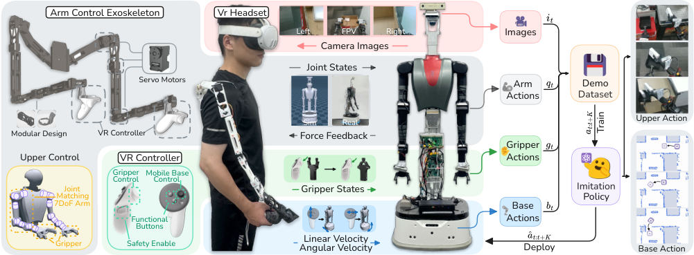
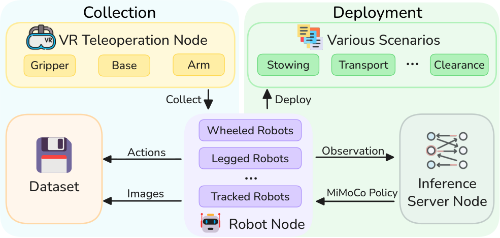
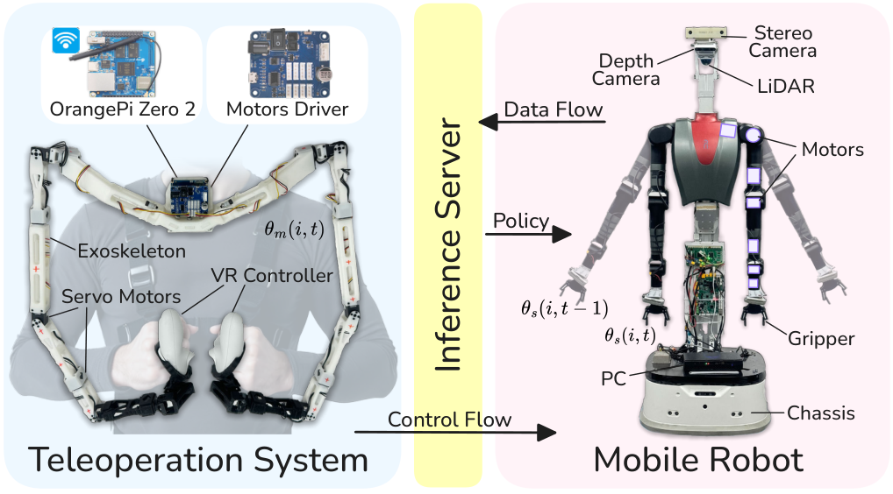
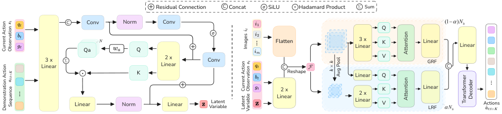
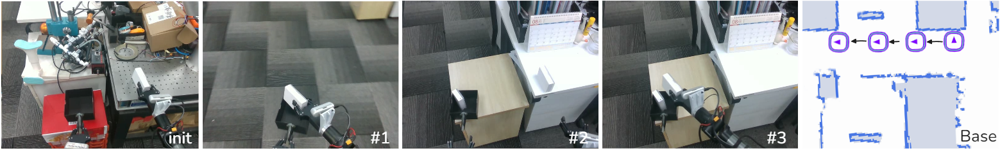
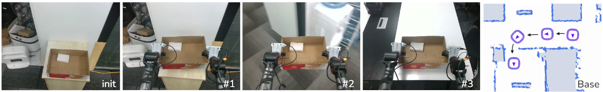
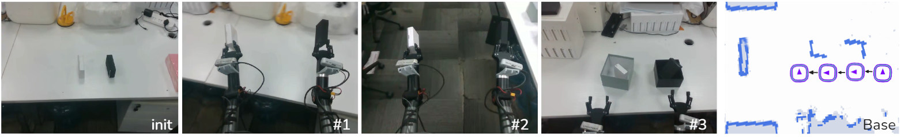
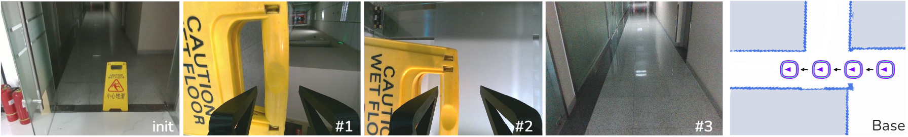
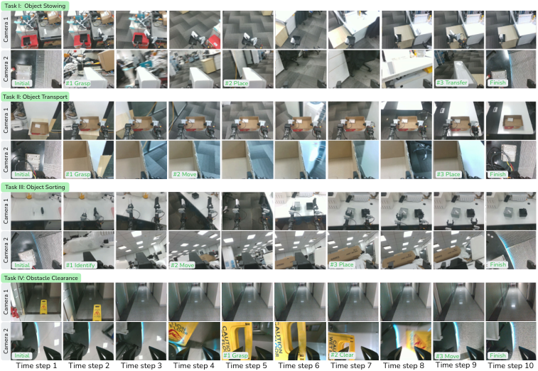

# MiMoCo

**MiMoCo: A Multimodal Imitation Learning Framework for Whole-Body Mobile Control with Exoskeleton-VR Teleoperation**

[中文](README_ZH.md) | [English](README.md)

[](#)
[](LICENSE)

This repository is the **official open-source project** for **MiMoCo** (IEEE Internet of Things Journal), providing a complete technical pipeline from **exoskeleton-VR teleoperation data collection** to **whole-body mobile manipulation imitation learning**. We continuously release code, models, and documentation following the paper structure.

<!-- ## 📋 Contents

- [🏠 Introduction](#-introduction)
- [🧭 System Architecture](#-system-architecture)
- [🤖 Exoskeleton-VR Teleoperation](#-exoskeleton-vr-teleoperation)
- [🧠 MiMoCo Network Architecture](#-mimoco-network-architecture)
- [🧪 Experimental Tasks](#-experimental-tasks)
- [🔥 Open-Source Progress](#-open-source-progress)
- [📚 Quick Start](#-quick-start)
- [📁 Repository Structure](#-repository-structure)
- [🔗 Citation](#-citation)
- [📄 License](#-license)
- [👏 Acknowledgements](#-acknowledgements) -->

---

<p align="center">
  
</p>
<p align="center"><em>Fig. 1: MiMoCo overview. The exoskeleton-VR teleoperation system enables single-operator whole-body mobile control with simple force feedback for multimodal demonstration collection; the learned imitation policy generates action sequences for whole-body mobile manipulation.</em></p>

---

## 🏠 Introduction

In Industrial Internet of Things (IIoT) scenarios, **whole-body mobile manipulation** (dual-arm + mobile-base coordination) is critical for smart manufacturing and flexible automation, and it requires both high-quality demonstrations and reliable long-horizon multimodal action prediction. MiMoCo consists of:

1. **Integrated Exoskeleton-VR Teleoperation**: single-operator whole-body mobile control, with joint-level mapping and simple force feedback from the exoskeleton, and immersive FPV plus base control from VR.
2. **MiMoCo Imitation Learning Framework** (CVAE + action chunking):
   - **ECM-Net** (encoder): linear-complexity phase-level temporal modeling to mitigate long-horizon error accumulation.
   - **MRF-Net** (decoder): dual-path Global Receptive Field (GRF) + Local Receptive Field (LRF) visual-motor fusion to align macro-navigation and micro hand-eye manipulation.

On the real-world dual-arm wheeled robot **Robint**, across four tasks (stowing, transport, sorting, obstacle clearance), MiMoCo outperforms ACT, Diffusion Policy, and BeT baselines on multiple subtasks.

---

## 🧭 System Architecture

<p align="center">
  
</p>
<p align="center"><em>Fig. 2: End-to-end architecture. Left: exoskeleton-VR teleoperation collects arm, gripper, and base commands. Right: the trained MiMoCo policy generates whole-body control actions from robot observations.</em></p>

| Stage | Description |
|------|-------------|
| **Data Collection** | Three-view RGB (head, left wrist, right wrist) + proprioception + 18-D whole-body actions, 50 Hz (\(\Delta t = 20\) ms) |
| **Policy Learning** | ECM-Net encodes action chunks into latent \(\mathbf{z}\); MRF-Net fuses multi-camera visual features and \(\mathbf{s}_t\) to decode the next \(K\)-step actions |
| **Deployment** | Inference uses \(\mathbf{z}=\mathbf{0}\); overlapping chunk temporal ensembling with exponential weighting (\(m=0.01\)) for smooth control |

---

## 🤖 Exoskeleton-VR Teleoperation

<p align="center">
  
</p>
<p align="center"><em>Fig. 3: Integrated exoskeleton-VR teleoperation system (left) and wheeled robot Robint (right).</em></p>

- **Exoskeleton dual arms**: 7 DoF per arm with isomorphic structure to human arms; real-time joint mapping and overload-triggered force feedback.
- **VR (Meta Quest 3)**: joysticks for linear/angular base velocity, trigger for gripper aperture, grip button as enable switch, and head-mounted first-person visual feedback.
- **Control and communication**: OrangePi Zero 2 + distributed ROS nodes; multi-source timestamp alignment and low-pass filtering.
- **Force feedback**: when \(\Delta\Theta(t) > \tau_{\mathrm{total}}\) (\(\tau_{\mathrm{total}}=0.15\) rad in deployment), the exoskeleton is locked to indicate contact overload and improve operational safety.

---

## 🧠 MiMoCo Network Architecture

<p align="center">
  
</p>
<p align="center"><em>Fig. 4: Left, ECM-Net for phase-level temporal context modeling. Right, MRF-Net for GRF macro planning + LRF fine manipulation via dual-path attention.</em></p>

**Input**: multi-camera RGB \(\{i_t\}\), proprioception \(\mathbf{s}_t = [q_t, g_t, b_t] \in \mathbb{R}^{18}\) (14-D dual-arm + 2-D gripper + 2-D base velocity).  
**Output**: future action chunk \(\hat{a}_{t:t+K}\), with \(K=100\) steps and 18-D whole-body targets.  
**Objective**: action L1 + KL divergence (KL weight = 10); **inference** uses \(\mathbf{z}=\mathbf{0}\).

| Module | Paper Design | Code Path (continuously updated) |
|------|---------------|-----------------------------------|
| ECM-Net | Learnable \(w_a\) to compress global phase intent and gate historical retrieval over \(K\) | `mimoco_models/models/` encoder |
| MRF-Net | LRF local windows (\(k=6\)) + GRF global GAP; head split ratio \(\alpha=0.4\) | `mimoco_models/models/transformer.py` |
| Visual Backbone | Per-camera ResNet-18 + 2D sinusoidal position encoding | `mimoco_models/models/backbone.py` |
| Policy Wrapper | CVAE + chunk decoding | `policy.py` -> `ChunkSeqPolicy` (`CHUNK_SEQ`) |

**Default hyperparameters** (aligned with paper Sec. IV): \(d_{\mathrm{model}}=512\), FFN \(=3200\), 8 heads, 4 encoder layers / 7 decoder layers, about 103.77M parameters.

---

## 🧪 Experimental Tasks

<p align="center">
  
  
</p>
<p align="center">
  
  
</p>
<p align="center"><em>Figs. 5-8: Task setups for Object Stowing, Object Transport, Object Sorting, and Obstacle Clearance.</em></p>

| Task | Subtasks | Key Difficulty |
|------|----------|----------------|
| Object Stowing | Grasp -> Place -> Transfer | Bimanual coordination + long-range base motion (~3.5 m) |
| Object Transport | Grasp -> Move -> Place | Narrow doorway traversal, ~7 m motion horizon |
| Object Sorting | Identify -> Move -> Place | Color-based object identification and placement |
| Obstacle Clearance | Grasp -> Clear -> Move | Grasp obstacle, clear it, and pass through constrained space |

Each task contains 50 demonstrations collected by a single operator; image resolution is \(480 \times 640\) with three cameras.

<p align="center">
  
</p>
<p align="center"><em>Fig. 10: Sequential execution across four whole-body mobile manipulation tasks (macro head view + fine wrist view).</em></p>

---

## 🔥 Open-Source Progress

We track release progress by paper modules (✅ released in this repo · 🚧 upcoming release).

### Imitation Learning and Data

| Module | Status | Notes |
|------|------|------|
| HDF5 episodic loading and normalization | ✅ | [`utils.py`](utils.py), `EpisodicDataset` |
| MiMoCo policy training (`CHUNK_SEQ`) | ✅ | CVAE + action chunking, [`imitate_episodes.py`](imitate_episodes.py) |
| Baselines: Diffusion Policy, CNNMLP | ✅ | [`policy.py`](policy.py) |
| Training logs and checkpoints | ✅ | W&B + `policy_best.ckpt` |
| Validation-loss evaluation | ✅ | `imitate_episodes.py --eval` |
| HDF5 visualization | ✅ | [`visualize_episodes.py`](visualize_episodes.py) |
| Full ECM-Net implementation | 🚧 | Phase-gated temporal encoder (Sec. III-B-2) |
| Full MRF-Net implementation | 🚧 | LRF/GRF dual-path with configurable \(\alpha\), \(k\) (Sec. III-B-3) |
| Inference temporal ensembling (Alg. 2) | 🚧 | \(w_j=\exp(-mj)\), \(m=0.01\) |
| Explicit 18-D \(\mathbf{s}_t=[q,g,b]\) input | 🚧 | Paper-aligned observation space |
| BeT baseline | 🚧 | Paper comparison baseline |
| ECM-only / MRF-only ablation switches | 🚧 | Paper ablation table |
| Real-robot rollout + subtask success scripts | 🚧 | Sec. IV metrics |
| Long-horizon MSE / attention visualization scripts | 🚧 | Sec. IV-F |

### Teleoperation and Deployment

| Module | Status | Notes |
|------|------|------|
| Paper figures [`figures/`](figures/) | ✅ | Overview, architecture, tasks, and experiment figures |
| Exoskeleton-VR ROS teleoperation stack | 🚧 | Collection, force feedback, and timestamp sync |
| Real-robot deployment nodes | 🚧 | Observation subscriber + chunk execution + temporal ensembling |
| Example dataset release | 🚧 | Format spec in [`data/README.md`](data/README.md) |

---

## 📚 Quick Start

### Environment

1. Python 3.9+ (see dependencies in [`conda_env.yaml`](conda_env.yaml)).
2. Install model package:

```bash
cd mimoco_models && pip install -e . && cd ..
```

3. For the **Diffusion** baseline, install `robomimic`, `diffusers`, and related dependencies separately.

### Environment Variables

| Variable | Description |
|------|------|
| `MIMOCO_DATA_DIR` | Dataset root directory, default `data/` |
| `WANDB_PROJECT` | W&B project name (default `mimoco`) |
| `MIMOCO_PRETRAIN_CKPT` | Pretrained checkpoint path when using `--load_pretrain` |
| `MIMOCO_TRAIN_NUM_WORKERS` | DataLoader workers (default 8) |

### HDF5 Data Format

One `.hdf5` per episode; camera keys must match `--camera_names`:

| Key | Description |
|-----|-------------|
| `/observations/qpos` | Proprioceptive state |
| `/observations/images/<camera>` | RGB images, e.g., `cam_high`, `cam_left_wrist`, `cam_right_wrist` |
| `/action` | Arm + gripper targets |
| `/base_action` | Base velocity (optional; if missing, zeros are appended, yielding 18-D action) |

### Train MiMoCo (`CHUNK_SEQ`)

```bash
export MIMOCO_DATA_DIR=./data/my_dataset

python imitate_episodes.py \
  --ckpt_dir ./checkpoints/run1 \
  --policy_class CHUNK_SEQ \
  --dataset_dir "$MIMOCO_DATA_DIR" \
  --episode_len 400 \
  --camera_names cam_high,cam_left_wrist,cam_right_wrist \
  --kl_weight 10 \
  --chunk_size 100 \
  --hidden_dim 512 \
  --batch_size 8 \
  --dim_feedforward 3200 \
  --lr 1e-5 \
  --seed 0 \
  --num_steps 200000
```

```powershell
$env:MIMOCO_DATA_DIR = ".\data\my_dataset"
python imitate_episodes.py --ckpt_dir .\checkpoints\run1 --policy_class CHUNK_SEQ `
  --dataset_dir $env:MIMOCO_DATA_DIR --episode_len 400 `
  --camera_names cam_high,cam_left_wrist,cam_right_wrist `
  --kl_weight 10 --chunk_size 100 --hidden_dim 512 --batch_size 8 `
  --dim_feedforward 3200 --lr 1e-5 --seed 0 --num_steps 200000
```

Validation:

```bash
python imitate_episodes.py --eval --ckpt_dir ./checkpoints/run1
```

Visualization:

```bash
python visualize_episodes.py --dataset_dir "$MIMOCO_DATA_DIR" --episode_idx 0
```

Control frequency is aligned with the paper: `FPS=50`, `DT=0.02` in [`constants.py`](constants.py).

---

## 📁 Repository Structure

| Path | Description |
|------|-------------|
| [`figures/`](figures/) | Paper figures (PNG) |
| [`imitate_episodes.py`](imitate_episodes.py) | Training / validation entry |
| [`policy.py`](policy.py) | MiMoCo (`ChunkSeqPolicy`) and baselines |
| [`mimoco_models/`](mimoco_models/) | ResNet backbone, Transformer, SeqVAE |
| [`utils.py`](utils.py) | Data loading |
| [`constants.py`](constants.py) | Control-period constants |

---

---

## 🔗 Citation

If you use this codebase or MiMoCo method, please cite:

```bibtex
@article{mei2025mimoco,
  title={MiMoCo: A Multimodal Imitation Learning Framework for Whole-Body Mobile Control with Exoskeleton-VR Teleoperation},
  author={Mei, Jie and Wu, Xinkai and Zhang, Yue and Song, Tao and Xiong, Zhongxia},
  journal={IEEE Internet of Things Journal},
  year={2025}
}
```

## 📄 License

See [`LICENSE`](LICENSE). `mimoco_models` follows Apache 2.0 ([`mimoco_models/LICENSE`](mimoco_models/LICENSE)).

## 👏 Acknowledgements

This repository is inspired by the following open-source projects, and partially references their engineering organization and implementation patterns:

- [ALOHA](https://github.com/tonyzhaozh/aloha): teleoperation and HDF5 data collection workflow design (multi-device data acquisition, recording, and visualization script organization).
- [ACT](https://github.com/tonyzhaozh/act): Action Chunking with Transformers training paradigm, `imitate_episodes.py`-style training entry, and CVAE + chunk prediction/evaluation workflow.
- [OpenHomie](https://github.com/InternRobotics/OpenHomie): integrated whole-body loco-manipulation with isomorphic exoskeleton teleoperation and modular hardware-policy-deployment open-source organization.
